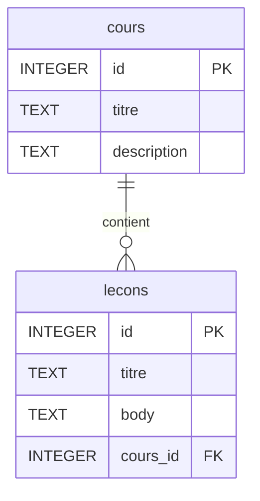
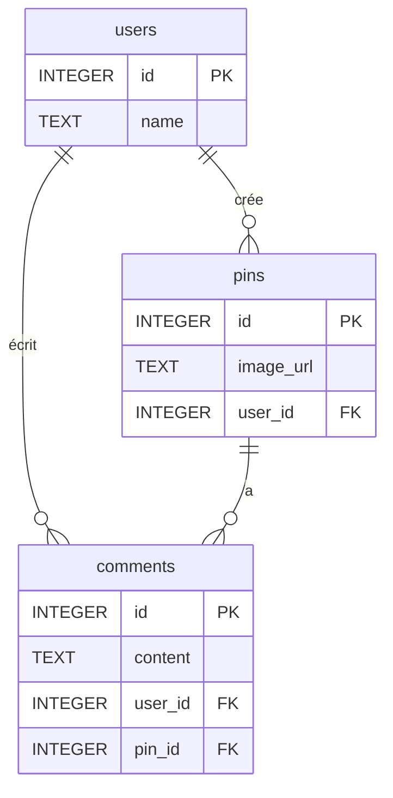
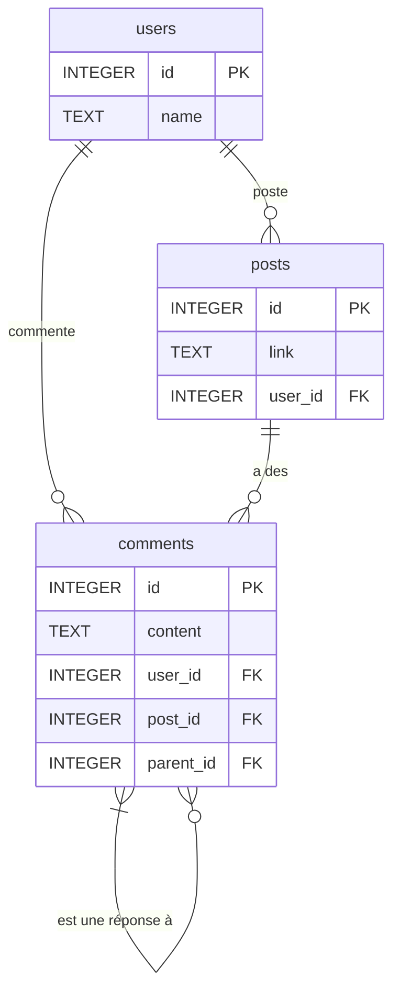
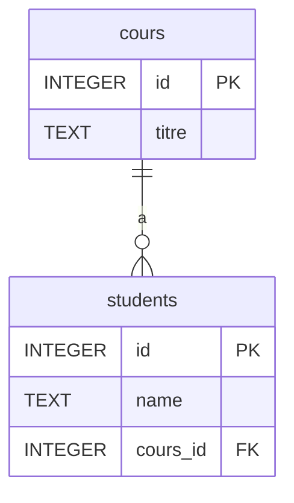

# BDD_SQL

## MOOCademy

Plateforme d'apprentissage en ligne. Chaque cours a plusieurs leçons.



```sql
CREATE TABLE "cours" (
	"id"	INTEGER PRIMARY KEY AUTOINCREMENT,
	"titre"	TEXT,
	"description"	TEXT
);

CREATE TABLE "lecons" (
	"id"	INTEGER PRIMARY KEY AUTOINCREMENT,
	"titre"	TEXT,
	"body"	TEXT,
	"cours_id" INTEGER,
	FOREIGN KEY("cours_id") REFERENCES "cours"("id")
);
```

Exemple de requête pour joindre les deux tables :
```sql
SELECT * FROM lecons
JOIN cours ON lecons.cours_id = cours.id;
```

## The Hacking Pinterest

Clone de Pinterest. Les utilisateurs créent des "pins" (avec une image) et peuvent les commenter.



```sql
CREATE TABLE "users" (
	"id"	INTEGER PRIMARY KEY AUTOINCREMENT,
	"name"	TEXT
);

CREATE TABLE "pins" (
	"id"	INTEGER PRIMARY KEY AUTOINCREMENT,
	"image_url"	TEXT,
	"user_id"	INTEGER,
	FOREIGN KEY("user_id") REFERENCES "users"("id")
);

CREATE TABLE "comments" (
	"id"	INTEGER PRIMARY KEY AUTOINCREMENT,
	"content"	TEXT,
	"user_id"	INTEGER,
	"pin_id"	INTEGER,
	FOREIGN KEY("user_id") REFERENCES "users"("id"),
	FOREIGN KEY("pin_id") REFERENCES "pins"("id")
);
```

## The Hacking News

Clone de Hacker News. Les utilisateurs postent des liens, et peuvent commenter les liens ou commenter d'autres commentaires.



```sql
CREATE TABLE "users" (
	"id"	INTEGER PRIMARY KEY AUTOINCREMENT,
	"name"	TEXT
);

CREATE TABLE "posts" (
	"id"	INTEGER PRIMARY KEY AUTOINCREMENT,
	"link"	TEXT,
	"user_id"	INTEGER,
	FOREIGN KEY("user_id") REFERENCES "users"("id")
);

CREATE TABLE "comments" (
	"id"	INTEGER PRIMARY KEY AUTOINCREMENT,
	"content"	TEXT,
	"user_id"	INTEGER,
	"post_id"	INTEGER,
	"parent_id" INTEGER, -- Référence à un autre commentaire (NULL si c'est un commentaire de post)
	FOREIGN KEY("user_id") REFERENCES "users"("id"),
	FOREIGN KEY("post_id") REFERENCES "posts"("id"),
	FOREIGN KEY("parent_id") REFERENCES "comments"("id")
);
```

## The Hacking Class

Site d'éducation où des élèves s'inscrivent à un seul cours. Un cours peut avoir plusieurs élèves.



```sql
CREATE TABLE "cours" (
	"id"	INTEGER PRIMARY KEY AUTOINCREMENT,
	"titre"	TEXT
);

CREATE TABLE "students" (
	"id"	INTEGER PRIMARY KEY AUTOINCREMENT,
	"name"	TEXT,
	"cours_id"	INTEGER,
	FOREIGN KEY("cours_id") REFERENCES "cours"("id")
);
```
